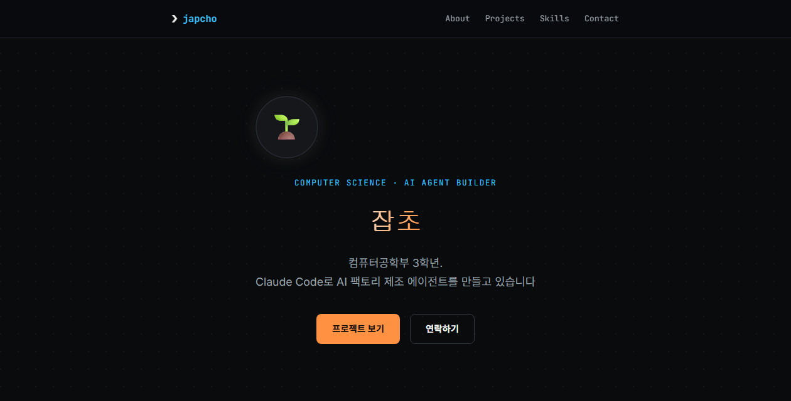

<div align="center">

<a href="https://crowtit517.github.io/portfolio/">
  
</a>

<br><br>

# ❯ japcho_

**컴퓨터공학부 3학년이고, AI와 제조 현장을 잇는 걸 좋아합니다.**

[](https://crowtit517.github.io/portfolio/)


</div>

---

## ❯ 소개

안녕하세요! 저는 컴퓨터공학을 공부하고 있는 학생이고, 요즘은 공장에서
쓰이는 AI 에이전트를 만드는 데 푹 빠져 있습니다. 이 저장소는 그런 저를
소개하는 개인 포트폴리오 사이트예요. 위 이미지를 클릭하면 실제 사이트로
이동합니다.

## ❯ 사이트 보러 가기

**👉 [crowtit517.github.io/portfolio](https://crowtit517.github.io/portfolio/)**

이 저장소의 `main` 브랜치에 새로운 내용을 올리면, 사이트에도 자동으로
반영됩니다. 따로 배포 작업을 할 필요가 없어요.

## ❯ 어떤 느낌으로 만들었나요

| | |
|---|---|
| 분위기 | 공장의 따뜻한 주황빛과 AI의 시원한 하늘빛, 두 색을 함께 썼어요 |
| 색깔 | 주황 `#ff9142` · 하늘색 `#3ac2ff` |
| 글꼴 | 제목은 타이핑 느낌 나는 고정폭 글꼴(JetBrains Mono), 본문은 깔끔한 Inter |
| 소소한 재미 | 링크에 마우스를 올리면 `❯` 표시가 스르륵 나타나요, 마치 터미널 프롬프트처럼요 |

## ❯ 무엇으로 만들었나요

- HTML과 CSS만으로 만든 한 개짜리 파일이에요 (별도 프레임워크 없음)
- 스크롤할 때 요소들이 부드럽게 나타나는 효과는 순수 자바스크립트로 구현했어요
- 사이트는 GitHub Pages를 통해 무료로 호스팅하고 있어요

## ❯ 저장소 구성

```
portfolio/
├── index.html     # 사이트의 전부 (HTML + CSS + JS 한 파일)
├── preview.png    # README에 보이는 미리보기 이미지
└── .nojekyll      # GitHub Pages가 이 사이트를 있는 그대로 보여주게 하는 파일
```

## ❯ 내 컴퓨터에서 직접 열어보기

```bash
git clone https://github.com/Crowtit517/portfolio.git
cd portfolio
python -m http.server 8000
# 브라우저에서 http://localhost:8000 접속
```

## ❯ 연락하기

궁금한 점이 있거나 함께 이야기 나누고 싶다면 편하게 연락 주세요.

[](https://github.com/Crowtit517)

---

<div align="center">
<sub>© 2026 잡초. 진심을 담아 HTML과 CSS로 만들었습니다.</sub>
</div>
